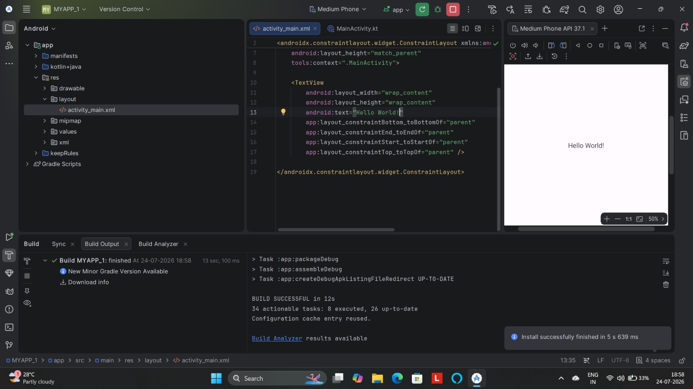
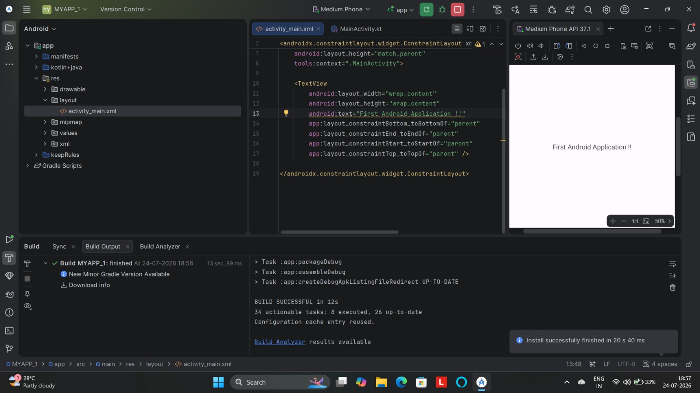

USN : 25MCAR0203 , HARSH VISHWAKARMA 

# Android Experiments Repository - Harsh VIshwakarma (25MCAR0203)

This repository contains a collection of Android development experiments completed as part of the curriculum.

## Experiments List

### 1. [Experiment 1: Introduction to Android Development](README.md)
- **Topic**: Environment Setup, Hello World, UI Basics.
- **Location**: `:app` module.

### 2. [Experiment 2: Activity Lifecycle](README_Experiment2.md)
- **Topic**: Understanding Activity state transitions using callback methods.
- **Location**: `:app_lifecycle` module.

### 3. [Experiment 3: Intents & List Interaction](README_Experiment3.md)
- **Topic**: Data passing between activities using Explicit Intents and ListViews.
- **Location**: `:app_intent` module.

---

## Original README (Experiment 1 Content)

## Overview
This experiment demonstrates the foundational steps of setting up an Android development environment using Android Studio. It covers project creation, understanding the basic structure of an Android application, and building a simple "Hello World" application personalized with student details.

## Concept & Technology
- **Android Studio**: The official Integrated Development Environment (IDE) for Android app development.
- **Kotlin**: The modern, statically typed programming language used for Android development.
- **XML (Extensible Markup Language)**: Used to define the User Interface (UI) layouts.
- **Gradle**: An advanced build toolkit that manages dependencies and allows for custom build logic.
- **Activity**: A single, focused thing that the user can do. Almost all activities interact with the user, so the Activity class takes care of creating a window for you.

## Scenario
The goal is to create a basic Android application that displays a "Hello World" message along with the student's Name and USN. This serves as a "Smoke Test" to ensure the development environment (JDK, Android SDK, and IDE) is correctly configured and that the developer understands the project lifecycle.

## Project Structure
Below is a breakdown of the key folders and files in the project:

```text
MYAPP_1/
├── app/                        # Main application module
│   ├── build.gradle.kts       # Module-level build configuration
│   └── src/
│       ├── main/
│       │   ├── AndroidManifest.xml # Core app configuration (permissions, activities)
│       │   ├── java/com/example/myapp_1/
│       │   │   └── MainActivity.kt    # Main logic of the application
│       │   └── res/           # Resources folder
│       │       ├── layout/
│       │       │   └── activity_main.xml # UI Layout definition
│       │       └── values/
│       │           └── strings.xml      # String resources for localization
│       └── test/              # Unit tests
├── build.gradle.kts           # Project-level build configuration
├── settings.gradle.kts        # Project settings and module inclusion
└── images/                    # Screenshots for documentation
```

## Output Screenshot
The following screenshot shows the main screen of the application running on an Android device:



## Test Cases

### Test Case 1: Successful Application Launch
- **Description**: Verify that the application successfully compiles, builds, and launches on an Android device or emulator.
- **Expected Result**: The app should open without crashing and display the initial layout.
- **Screenshot**:
  

### Test Case 2: UI Component Verification
- **Description**: Verify that the "Hello World" text view is correctly positioned and visible in the center of the screen.
- **Expected Result**: The text "Hello World!" must be clearly visible.
- **Screenshot**:
  

### Test Case 3: Personalization and USN Verification
- **Description**: Verify that the application displays the student's specific Name and USN as required by the experiment criteria.
- **Expected Result**: The screen should display "Harsh VIshwakarma" and "25MCAR0203".
- **Screenshot**:
  

---
**Developed by:** Harsh VIshwakarma  
**USN:** 25MCAR0203
