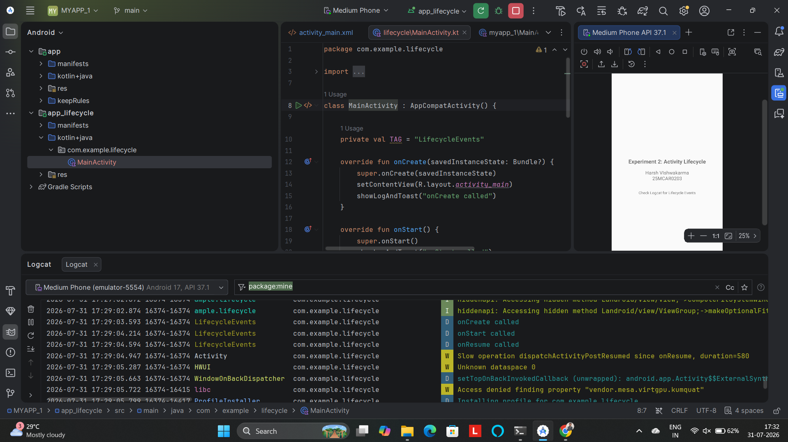
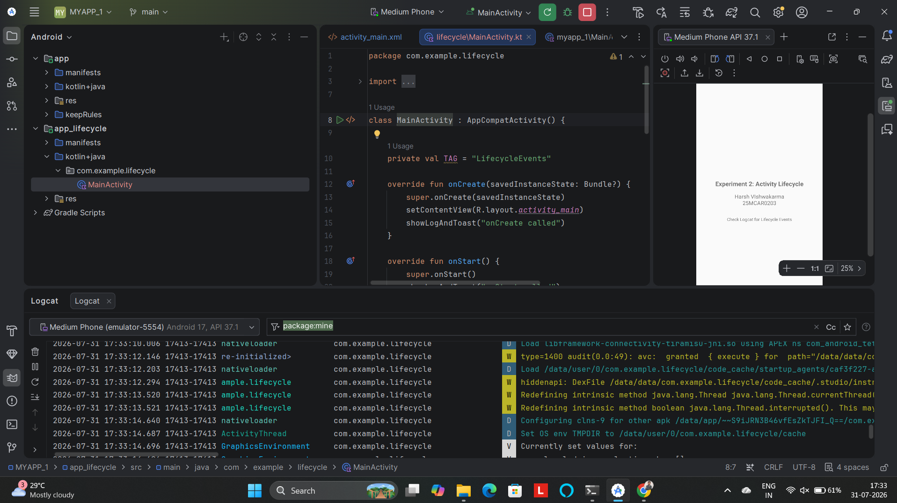

# Experiment 2: Android Activity Lifecycle

## Overview
This experiment explores the fundamental concept of the **Activity Lifecycle** in Android. Every `Activity` in an Android app goes through a series of states (Created, Started, Resumed, Paused, Stopped, Destroyed). Understanding these states is crucial for managing resources, saving UI state, and providing a seamless user experience.

## Concept & Technology
- **Activity Lifecycle**: A set of callback methods provided by the Android framework that are invoked when an activity transitions between states.
    - `onCreate()`: Called when the activity is first created.
    - `onStart()`: Called when the activity becomes visible to the user.
    - `onResume()`: Called when the activity starts interacting with the user.
    - `onPause()`: Called when the activity is no longer in the foreground (e.g., another activity is starting).
    - `onStop()`: Called when the activity is no longer visible.
    - `onRestart()`: Called when the activity is stopped and then started again.
    - `onDestroy()`: Called before the activity is destroyed.
- **Logcat**: A tool in Android Studio used to view system logs and app-specific debug messages.
- **Toasts**: Small pop-up messages used to provide simple feedback about an operation.

## Scenario
The application consists of a single activity that overrides all lifecycle callback methods. Each method contains a `Log.d` statement and a `Toast` notification. By performing various actions (launching the app, pressing Home, returning to the app, closing the app), the developer can observe the sequence of lifecycle events in the Logcat window.

## Project Structure (Experiment 2)
```text
app_lifecycle/
├── src/
│   ├── main/
│   │   ├── AndroidManifest.xml
│   │   ├── java/com/example/lifecycle/
│   │   │   └── MainActivity.kt    # Logic for logging lifecycle events
│   │   └── res/
│   │       ├── layout/
│   │       │   └── activity_main.xml # Displays student details and instructions
│   │       └── values/
│   │           └── strings.xml      # String resources
└── build.gradle.kts
```

## Output Screenshot
*Below is the UI of Experiment 2 showing student details:*


## Demo Video
*Demonstration of Activity Lifecycle transitions:*

https://github.com/harshvishwakarm07/MY_First_App/raw/main/images/exp2/myAPp-2.mp4

## Test Cases

### Test Case 1: Application Launch (Full Start)
- **Description**: Launch the app from the app drawer.
- **Scenario**: App moves from non-existent to foreground.
- **Expected Sequence**: `onCreate` -> `onStart` -> `onResume`.
- **Screenshot**:
  

### Test Case 2: Backgrounding and Resuming
- **Description**: Press the **Home** button and then return to the app via the **Recents** menu.
- **Scenario**: App moves to background and then back to foreground.
- **Expected Sequence**: 
    - (Home): `onPause` -> `onStop`.
    - (Return): `onRestart` -> `onStart` -> `onResume`.
- **Screenshot**:
  

### Test Case 3: Proper Termination
- **Description**: Press the **Back** button from the main activity.
- **Scenario**: App is being finished by the user.
- **Expected Sequence**: `onPause` -> `onStop` -> `onDestroy`.
- **Screenshot**:
  

---
**Developed by:** Harsh VIshwakarma  
**USN:** 25MCAR0203
